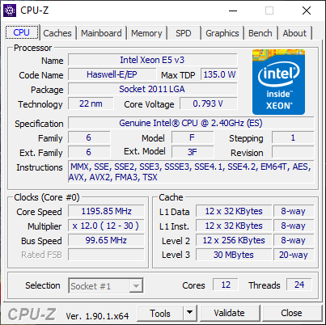

# ParallelVLAN
Parallel the Genetic Algorithm for optimizing VLAN

Initially, I translate the Genetic Algorithm Code from Python to C++ with the IDE CLion.

I run the openmp.cpp on personal computer with Intel Xeon E5 v3, which has 12 physical cores and 24 logical threads.

I haven't tested my code on Deac Cluster before. After I uploaded all the code on Deac Cluster, I found they cannot be compiled.

Later, I figured it out. The 'rhel7/gcc/8.2.0' and 'rhel7/gcc/8.2.0-libs' modules need to be loaded.

Another poential bug: I run 'srun --pty --partition=small --nodes=1 --ntasks=32 --mem=64GB' to reserve a computer node.

At the first time, source code cannot be compiled, and the debug message indicates it is because of including the <random> library.
  
At the second time, another computer node is assigned, and the bug does not show up.
